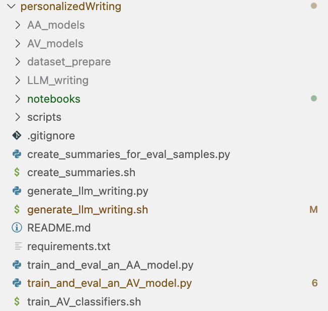

### Repo Structure 

- dataset_prepare (folder, need to download it yourself and unzip)
- notebooks (folder)
- scripts (folder)
- AA_models (folder, will be created once `train_and_eval_an_AA_model.py` is run)
- AV_models (folder, will be created once `train_and_eval_an_AV_model.py` is run)
- LLM_writing (folder, will be created once `generate_llm_writing.py` is run)
- other `.py` and `.sh` files as you can see

<p align='center'>
 
</p>


### Run the code

1. Create a conda environment: `conda create -n PW python=3.12.9`
2. Use the `PW` env whenever running the code: `conda activate PW`
3. install pip
4. run `pip install requirements.txt`
5. run some code and if there is a dependency error, fix it by installing the required package. This probably will  occur when first running `train_and_eval_an_AA_model.py` or `train_and_eval_an_AV_model.py`.

### Running LLM pipeline

We use [litellm](https://github.com/BerriAI/litellm) when making all of our LLM API calls. Remember to check the related documentation to see how to give the right model name given a specific service provider. For example, if you use `gpt-4o` from OpenAI directly, the model name will just be `openai/gpt-4o`.

Also, before you make any LLM API calls, remember to save the related API Key in your `PW` conda env. The syntax for that is as follows:

```
conda env config vars set -n myenv MY_VAR=value
```

The API Key name must be created according to [litellm](https://github.com/BerriAI/litellm). You can see a list of supported LLM providers [here](https://docs.litellm.ai/docs/providers).

When you have a hard time finding the right documentation, just do Google search!

Whenever you save an environment variable in conda, remember to deactivate the current env and reenter it in order for the variable to be accessible. 